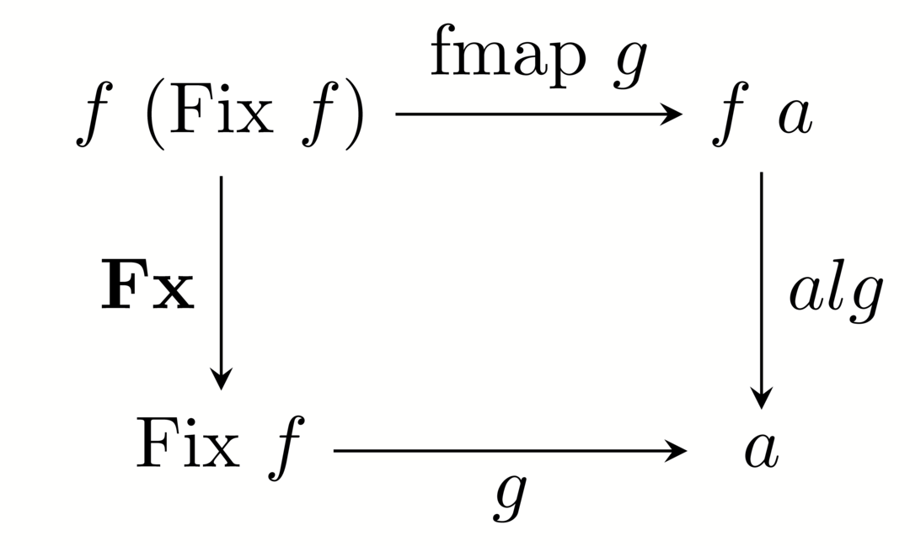
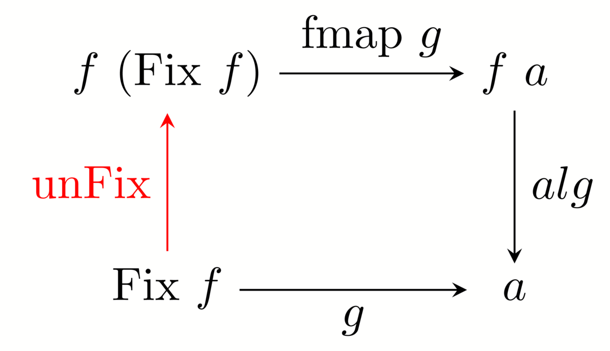

# F-Algebras or: How I Learned to Stop Worrying and Love the Type System

#### Anthony Burzillo

----

## Overview

* F-Algebras
* Catamorphisms
* Solving a simple expression tree
* Dealing with multiple types
* How to delay evaluation
* Typechecking (monadic F-Algebras)
* Translation

---

Let's take a look at an F-Algebra

```Haskell
type Algebra f a = f a -> a
```

What is this doing?

----

It says how to combine information held
in a functor!

----

For instance consider the following

```Haskell
data AddTree a
    = Only a
    | Add a a
    deriving (Functor, Show)
```

----

Now we can create an Algebra to do addition

```Haskell
data AddTree a
    = Only a
    | Add a a
    deriving (Functor, Show)

alg :: Algebra AddTree Int
alg (Only x)  = x
alg (Add x y) = x + y
```

Notice this assumes `Add` has only `Int`'s as
children -- no tree structures here!

---

Let's create this weird type in our system, the `Fix`
type and its corresponding `Fx` constructor

```Haskell
newtype Fix f = Fx (f (Fix f))
```

The type inside the `Fx` constructor is pretty strange. It
has itself within itself!

Indeed, the `Fix` type allows us to create trees of functor values.

----

The question boils down to:

Is there some function `g` such that

```Haskell
g :: Algebra f a -> Fix f -> a
```

??

----

```Haskell
newtype Fix f = Fx (f (Fix f))
```



----

We can also `unFix` a `Fix`'d type

```Haskell
unFix :: Fix f -> f (Fix f)
unFix (Fx x) = x
```

----

```Haskell
unFix :: Fix f -> f (Fix f)
unFix (Fx x) = x
```



----


```Haskell
g = alg . fmap g . unFix
```

----

Now we are ready for catamorphisms

```Haskell
cata :: Functor f => Algebra f a -> Fix f -> a
cata alg = alg . fmap (cata alg) . unFix
```

---

## Solving a simple expression tree

Suppose that we have the following type

```Haskell
data Ring a
    = Value Int
    | Add a a
    | Multiply a a
    deriving (Show, Functor)
```

This type models a value that can be added or subtracted.

----

```Haskell
data Ring a
    = Value Int
    | Add a a
    | Multiply a a
    deriving (Show, Functor)
```

It is important to note that the type `a` that is used for the
functor is *not* the type of a value held by the expression, but
the type of the *children* of the expression.

----

How can we solve expressions of this type using catamorphisms?

----

Easy

```Haskell
alg :: Num a => Algebra Ring Int
alg (Value x)      = x
alg (Add x y)      = x + y
alg (Multiply x y) = x * y

eval :: Num a => Fix Ring a -> a
eval = cata alg
```

Note that we can assume that the leaf nodes are already
evaluated.

----

Now we can evaluate some basic expressions

```Haskell
eval $ Fx Value 5 -- => 5
eval . Fx $ Add (Fx $ Value 3) (Fx $ Value 2)-- => 5
```

---

### What about multiple types?

----

#### Now we need to change our result type to deal with the possibility of failure

How do we do it?

----

Suppose we have the following

```Haskell
data Basic a
    = Boolean Bool
    | Value Int
    | If a a a
```

Now we can possibly fail if the
first argument of the `If` is not a `Boolean`.

----

How do we handle this possibility of failure in
the algebra?

----

One simple way could be

```Haskell
type Result = Maybe (Either Bool Int)

alg :: Algebra Basic Result
alg (Boolean x) = Just $ Left x
alg (Value x)   = Just $ Right x
alg (If c x y)  = c >>= \e -> case e of
    Left b -> if b then x else y
    _      -> Nothing

eval :: Fix Basic -> Result
eval = cata alg
```

----

#### But this means that we always evaluate both sides of the `If` statement!

What if we want to delay the evaluation?

---

### How to delay evaluation

----

To delay evaluation of certain parts of our expressions
we must define a new type of algebra

```Haskell
newtype LazyFix f = Fx' (f (LazyFix f) (LazyFix f))
```

An `unFix`

```Haskell
lazyUnFix :: LazyFix f -> f (LazyFix f) (LazyFix f)
lazyUnFix (Fx' x) = x
```

----

And a catamorphism

```Haskell
lazyCata :: Functor (f (LazyFix f))
         => Algebra (f (LazyFix f)) a
         -> LazyFix f
         -> a
lazyCata alg = alg . fmap (lazyCata alg) . lazyUnFix
```

----

Now we can solve expressions from the language

```Haskell
data Iffy a b
    = Boolean Bool
    | And b b
    | If b a a
```

very simply

```Haskell
alg :: Algebra (Iffy (LazyFix Iffy)) Bool
alg (Boolean b) = b
alg (And x y)   = x && y
alg (If p x y)  = eval $ if p then x else y

eval :: LazyFix Iffy -> Bool
eval = lazyCata alg
```

---

### A Brief Excursion in Typechecking

Consider the follwing type

```Haskell
data LittleExpr a b
    = Value Int
    | Add b b
    | Lambda String a
    | Application b b
    deriving (Functor, Show)
```

Note that we will be delaying the typechecking
of the `Lambda`'s expression.

----

How do we type this?

----

One common way of typechecking is through
use of the equational type system. This works
in three steps:

1. Generate equations that must be true according
to the expression.
2. Take the closure of the system of equations under
a few rules.
3. Ensure there are no contradictions.

----

More specifically, we will take the closure of the
system of equations

```
type Type = Integer | Boolean | Arrow Type Type | Var Int

type Equation = (Type, Type)
```

(more on `Var` later) under two rules

1. If `A = B` and `B = C` then `A = C`
2. If `A -> B = C -> D` then `A = C` and `B = D`.

----

Suppose that we have a function that returns the type of
an expression, `typecheck`. It is easy to see how to generate
the equation for an addition

```Haskell
typecheck (Add a b) = (typecheck a, typecheck b)
```

or more efficiently, we could add two equations

```
(Integer, typecheck a)
(Integer, typecheck b)
```

----

But how do we typecheck the lambda function? It has a variable
whose type needs to be found out from the context.

----

In this case we need to generate a type variable as a placeholder
for the type of the named variable in the lambda.

Of course, these generated type variables must be unique. How do
we do that?

----

Let's create a new form of Algebra

```Haskell
type MAlgebra m f a = f (m a) -> m a
```

----

And a two new catamorphisms

```Haskell
mcata :: Functor f => MAlgebra m f a -> Fix f -> m a
mcata alg = alg . fmap (mcata alg) . unFix

lazyMCata :: Functor (f (LazyFix f))
          => MAlgebra m (f (LazyFix f)) a
          -> LazyFix f
          -> m a
lazyMCata alg = alg . fmap (lazyMCata alg) . lazyUnFix
```

Now we can thread Monads through our evaluation!

----

First let's create a counter to generate type variables

```Haskell
type Counter = State Int

doNothing :: Counter Int
doNothing = state (\i -> (i, i))

newHandle :: Counter Int
newHandle = state (\i -> (i, i + 1))
```

----

Let's define some types for the algebra

```Haskell
type Equations = Set Equation
type Result = (Type, Equations)

type TypeAlg
    = MAlgebra Counter (LittleExpr (LazyFix LittleExpr)) Result

type Hypotheses = [(String, Type)]
```

----

And a helper function for combining sets and equations

```Haskell
twoAdd :: Equation
       -> Equation
       -> Equations
       -> Equations
       -> Equations
twoAdd e e' eq eq' = insert e . insert e' $ union eq eq'
```

----

Now we can define the algebra


```Haskell
alg :: Hypotheses -> TypeAlg
alg _ (Value _) = (\_ -> (Integer, empty)) <$> doNothing
alg _ (Add x y) = (\(t, e) (t', e') -> (Integer, twoAdd t t' e e')
    <$> x <*> y
alg g (Lambda n x) = newHandle >>= \v -> let h = Var v
    in genTypes ((n, h) : g) x >>= \(t, e) ->
        return (Arrow h t, e)
alg _ (Application x y) = (\v (t, e) (t', e') -> let h = Var v
        in (h, insert (t, Arrow t' h) $ union e e'))
    <$> newHandle <*> x <*> y

genTypes :: Hypotheses -> TypeAlg
genTypes h = lazyMCata (alg h)
```

----

And our typechecker!

```Haskell
typecheck :: LazyFix LittleExpr -> Bool
typecheck e = let eq = genTypes [] e
    in let c = closure eq
    in isConsistent c

-- closure and isConsistent are out of the scope of this
-- presentation.
```

---

## Great, now I can evaluate a bunch of small languages. How do I do something bigger?

----

Let's drink a little more of the F-Algebra Kool Aid and translate a larger language
into a smaller one!

----

Remember that `LittleExpr` language we had earlier?

```Haskell
data LittleExpr a b
    = Value Int
    | Add b b
    | Lambda String a
    | Application b b
    deriving (Functor, Show)
```

We can actually create `let` definitions of the form

```Haskell
let f x y z = x + y + z in f 2 3 5
```

using this language as a base.

----

It's important to note that the `let` definitions cannot be
recursive in this case.

If we needed recursive functions, we'd need to create an
additional expression in our `LittleExpr` language.

----

#### How do we transform this expression?

It's easy to do with a combination of `Lambda`'s and
`Application`'s.

----

Note that for any expression `e`, we can write the
function definition

```Haskell
f x y z = e
```

as

```Haskell
f = \x -> \y -> \z -> e
```

----

Furthermore, note that for any expressions `e`, `e'`
we can write

```Haskell
let x = e in e'
```

as

```Haskell
(\x -> e') e
```

----

Then for any expressions `e` and `e'`
we can write

```Haskell
let f x y z = e in e'
```

as

```Haskell
(\f -> e') (\x -> \y -> \z -> e)
```

----

Let's define our bigger language as

```Haskell
data BiggerExpr a
    = Value Int
    | Add a a
    | Lambda String a
    | Application a a
    | Let [String] a a
    deriving (Functor, Show)
```

----

We can translate the `Let` to `Lambda`'s and
`Application`'s using

```Haskell
transform :: [String] -> a -> a -> BiggerExpr a
transform [] = undefined
transform (f : xs) e e' = right left
    where right = Application f e'
          left  = foldr (\v x -> Lambda x v) e xs

-- (\f -> e') (\x -> \y -> \z -> e)
```

----

And our algebra is

```Haskell
alg :: Algebra BiggerExpr LittleExpr
alg (Value v)         = Value v
alg (Add x y)         = Add x y
alg (Lambda x e)      = Lambda x e
alg (Application f x) = Application f x
alg (Let xs e e')     = transform xs e e'

eval :: BiggerExpr a -> LittleExpr a
eval = cata alg
```

---

# That's it!

----

Hopefully I've inspired you to look a bit deeper into
the type system and what it can do for you!

Perhaps you won't ever use F-Algebras, but if I've done
my job right, you've seen how a little bit of abstraction
can really reduce the amount of work you have to do.

---

Credit for the inspiration and starting ideas
goes to [Bartosz Milewski](https://bartoszmilewski.com/)'s article
[*Understanding F-Algebras*](https://www.schoolofhaskell.com/user/bartosz/understanding-algebras).

Thanks for the inspiration to go further!
